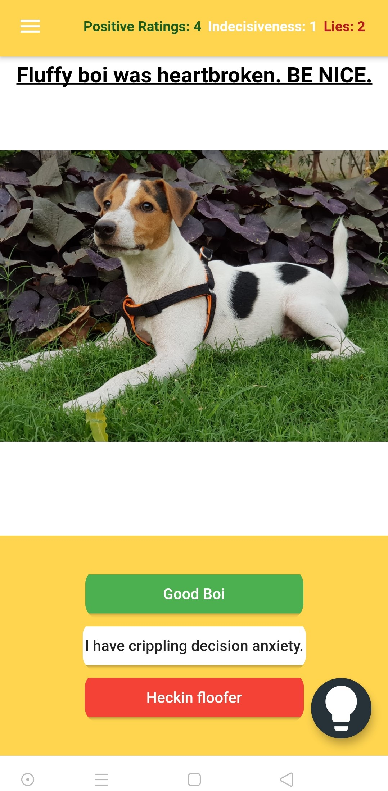
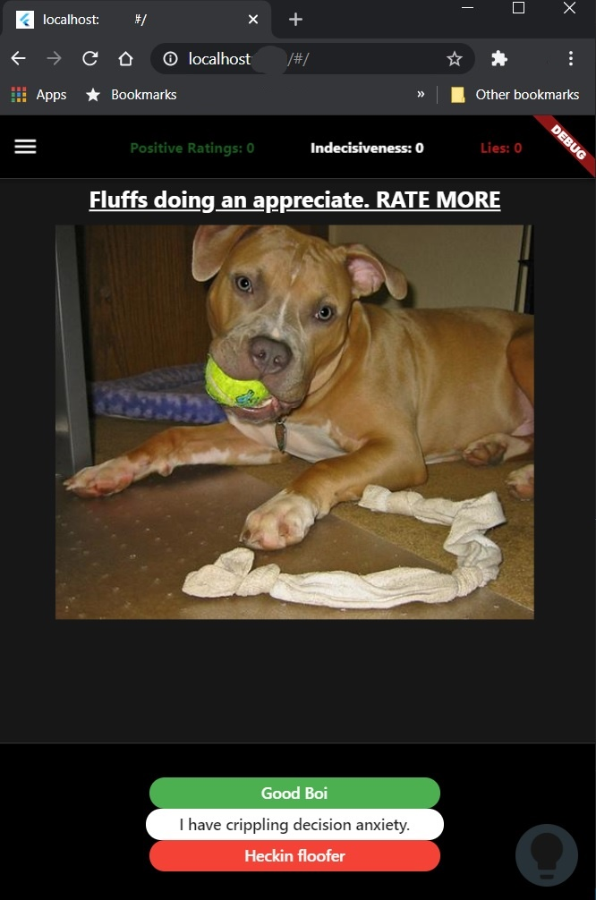
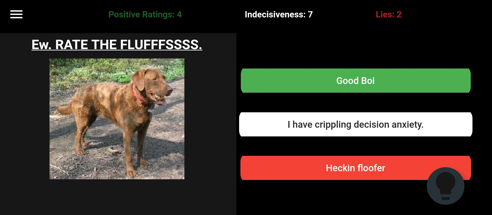
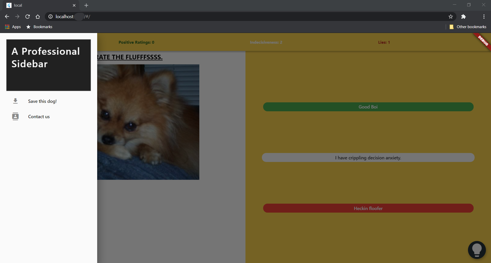
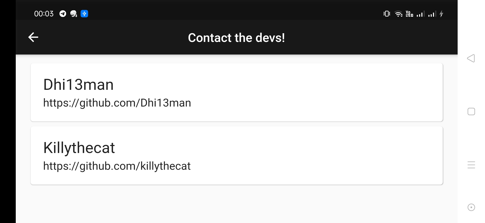

# Doggo Rater

Get to look at and rate photos of random Dogs from all over the internet.


## Install

Flutter SDK. Clone and run:

```sh
git clone https://github.com/Dhi13man/DoggoRater.git
cd DoggoRater
flutter pub get
flutter run
```

Photos come from the [Dog API](https://dog.ceo/dog-api/).

## ABOUT

Flutter app that was created by [Dhiman Seal (@dhi13man)](http://www.github.com/dhi13man) and [@KillyTheCat)](http://www.github.com/killythecat), just as an excuse to learn the basics of Flutter, Requests and Futures.<br><br>
[Uses Dog API](https://dog.ceo/dog-api/)

### Screenshots

<table border=3>
<tr>
<th>
<center><b>Mobile App [Android, Portrait, Light Mode]:</b></center>
</th>
<th>
<center><b>Web App [Chrome, Portrait, Dark Mode]:</b></center>
</th>
</tr>

<tr>
<td>

</td>
<td>

</td>
</tr>
</table>

<table border=3>
<tr>
<th>
<center><b>Mobile App [Android, Landscape, Dark Mode]:</b></center>
</th>
</tr>
<tr>
<td>

</td>
</tr>

<tr>
<th>
<center><b>Web App Side Bar [Chrome, Landscape, Light Mode]:</b></center>
</th>
</tr>
<tr>
<td>

</td>
</tr>
<tr>
<th>
<center><b>Mobile App Contacts Page [Android, Landscape]:</b></center>
</th>
</tr>
<tr>
<td>

</td>
</tr>
</table>

<br>
<br>

## Feel free to make your own contributions to Doggo Rater. ❤

## Contributing

See [CONTRIBUTING.md](CONTRIBUTING.md).

## License

See [LICENSE](LICENSE).
